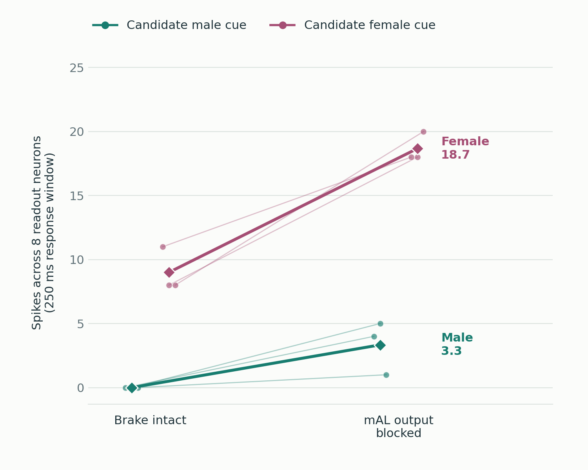

# Fruitless

A local Three.js fly animation with recorded activity from a 166,606-neuron MaleCNS model.

```sh
npm install
npm start
```

Open [localhost:8000](http://127.0.0.1:8000/). Requires Node.js and Python 3.

## What we did

We asked a small question: **does blocking mAL output let male-associated sensory input activate a courtship-related group of neurons?** Earlier biological work identifies mAL as an inhibitory pathway—a brake on courtship circuitry.

We used the measured MaleCNS wiring graph: 166,606 classified neurons and approximately 25.6 million connections. Simple spiking-neuron rules turn that anatomy into a simulation. Neurotransmitter labels and functional research guide which outputs excite or inhibit other cells; these effects remain modeling assumptions, not measured properties of every connection.

The experiment compares the same network receiving identical sensory inputs with **one intervention: blocking mAL output**. Inputs, connection rules, and firing thresholds stay fixed within each pair. We measure spikes in eight literature-mapped P1-related candidate neurons, without directly stimulating them. This makes the paired difference attributable to mAL output block within the model.

We tested all 36 combinations of three input pathways, three random seeds, two inhibition settings, and intact versus blocked mAL output. Repeating the comparison checks whether the effect survives changes in input randomness and inhibitory strength. It does not establish that the assumed cell identities, connection effects, or sensory inputs are biologically correct. Earlier exploratory experiments and model revisions are documented in the [full report](experiment/followup/RESULTS.md).

## What happened



In the setting shown in the chart, male-cue responses rose from zero to 1–5 spikes across three trials after mAL output was blocked. Female-cue responses rose from 8–11 to 18–20 spikes. The second inhibition setting also showed an increase in male-cue responses.

**The model showed increased responsiveness to male cues, not male preference.** Female cues still produced stronger responses. The result depends on assumed connection effects, candidate cell identities, input encoding, and neuron dynamics; it is not a biological replication or a fruitless gene edit.

## What you see

The 10-second loop replays one 300 ms male-cue simulation. The connectome displays available anatomical neuron positions, with flashes from recorded 10 ms spike bins. Lime marks P1-related spikes; violet rings mark spikes in mAL neurons whose outgoing transmission is blocked. Colors, glow, and afterglow are visual effects.

Fly movement is illustrative choreography: a nonzero recorded response makes a target eligible, and the nearer eligible target is male. The simulation does not predict the flight or mounting behavior. The chart shows paired neural responses across three seeds, rather than a probability of choosing a mate.

## Code

- `main.js` — scene, camera, labels, and playback.
- `fly.js` — anatomical fly loading and animation.
- `connectome.js` — neuron positions and recorded spike effects.
- `assets/` — fly meshes and playback data.
- `experiment/followup/` — current experiments, results, and figures.

See the [findings](experiment/followup/RESULTS.md), [protocol](experiment/followup/BOUNDED_ROUTE_PROTOCOL.md), and [reproduction notes](experiment/followup/README.md). Run `npm run check` for JavaScript syntax checks.

The [initial pilot](experiment/README.md) and [original reduced model](MODEL.md) remain available as experiment history. `/experiment.html` displays the initial pilot recordings.

## Credits

[MaleCNS](https://male-cns.janelia.org/download/) data: CC-BY. [NeuroMechFly / NeLy-EPFL](https://github.com/NeLy-EPFL/fly-svg-maker) meshes: Apache-2.0, notices in `assets/fly/`. [Three.js](https://threejs.org/): MIT. Inspired by [Kallman, Kim & Scott (2015)](https://elifesciences.org/articles/11188).
